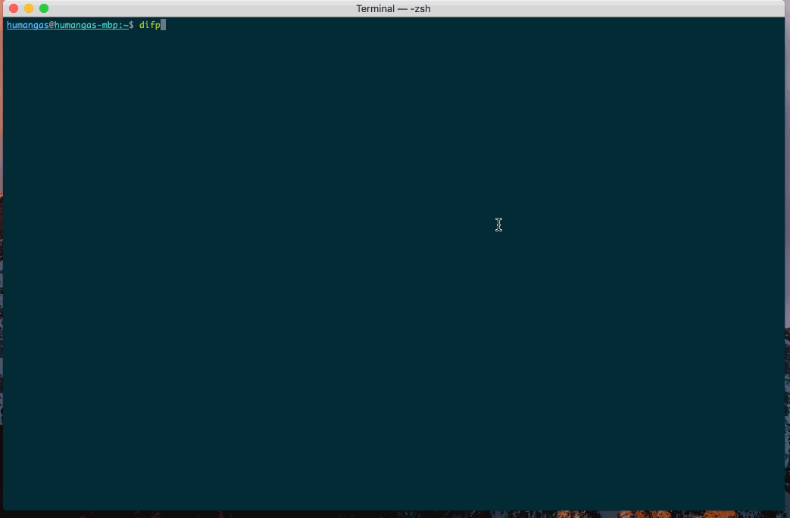

# diffplist
[](LICENSE)
[](OS)  
"diffplist" is a tool to quickly find differences in plist files.


## Installation
```
$ brew install --HEAD humangas/apps/diffplist
```
OR
```
$ git clone https://github.com/humangas/diffplist.git
$ cd diffplist
$ make install 
```


## Usage
```
Usage: diffp [subcommand] [<plist_name>]

Subcommand:
    list   [plist_name]:     List defaults domains
    show   [plist_name]:     defaults read [plist_name]
    watch  <plist_name>:     Watch diff <plist_name> (Stop with Ctrl+C)
    before <plist_name>:     defaults read > <plist_name>.bef.txt
    after  <plist_name>:     defaults read > <plist_name>.aft.txt
    diff   <plist_name>:     diff $DIFP_DIFF_OPTIONS <plist_name>.bef.txt <plist_name>.aft.txt

Settings:
    export DIFP_DIFF_OPTIONS="--side-by-side --left-column --width=150"

```

After confirming the setting value, you can change the setting with the following command, for example.
```
$ defaults write com.apple.dock tilesize -int 49
OR
$ plutil -replace tilesize -integer 49 ~/Library/Preferences/com.apple.dock.plist
$ killall Dock
```

## Demo

